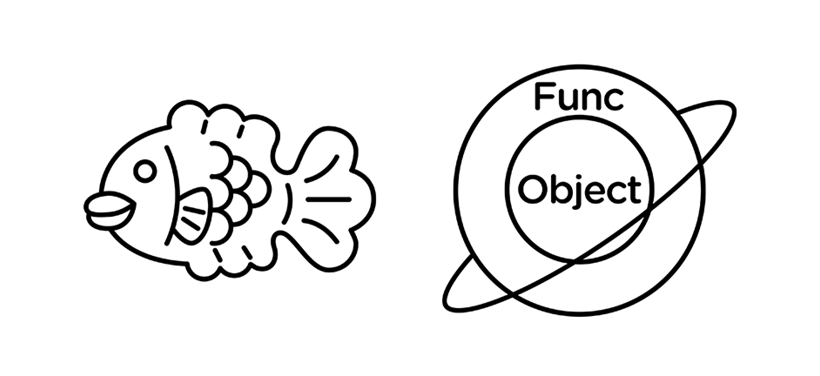

<div align="center">
  <h1>자바스크립트 초보자를 위한 튜토리얼 (작성중)</h1>
  <h6>ㅡ 2020년 코로나시대 Javascript는 더 이상 과거의 천대받던 언어가 아닙니다. ㅡ</h6>
</div>

**본 문서**는 Javascript의 세계에 몸을 담고 싶은 사람에게는 `좋은 시작점`이 될 것 이며, Javascript를 기본적으로 다룰줄은 알지만 원하는대로 작동하지 않는것에 대하여 **언어적 문제로 치부하고 불만**을 가지고 있던 당신에게는 `좋은 깨달음`이 될 것 입니다.<br>

많은것을 준비하지는 않았습니다, **하나하나 천천히** 읽어보다가 이해가 되지 않으면 `또 다른 여정`을 떠나다 오셔도 좋습니다.

## 학습전 요구사항

1. Javascript 말고 다른 언어를 사용한적이 있다.
2. 크롬 개발자 도구를 간단하게 사용할 수 있다.
3. 개발에 필요한 IDE를 이미 사용할줄 안다.

## Contents

- [Object](#Object)
- [Scope](#Scope)
- [This](#This)
- [Bind](#Bind)
- [Prototype](#Prototype)
- [Pattern](#Pattern)
  - [Assignment](#Assignment)
  - [Closer](#Pattern)
  - [MVC](#MVC)

## Object

> 오브젝트란

`오브젝트(Ojbect)` 한글로는 **객체**,

**Javascript**에서 모든 데이터와 함수는 이 `객체`라고 불리는 **녀석을 기반**으로 만들어졌습니다,<br>
물론 당연히 이 모든에는 **여러분들이 만들게 될 데이터와 함수**도 포함이 되어있다는 걸 기억해야합니다.



> 구조 확인

그럼 간단하게 오브젝트의 구조를 보겠습니다, 브라우저 개발자 도구 콘솔에 다음과 같은 커맨드를 입력하세요.
```Javascript
console.dir(Object);
```

## Scope
## This
## Bind
## Prototype
## Pattern
